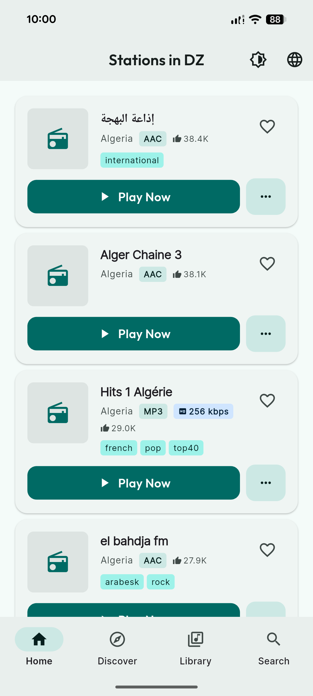
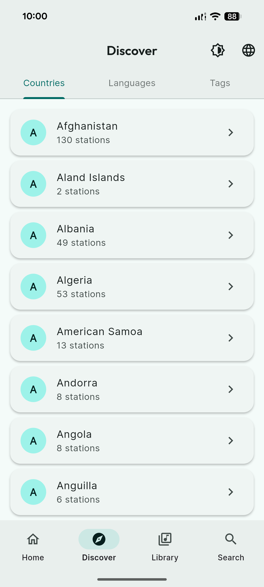
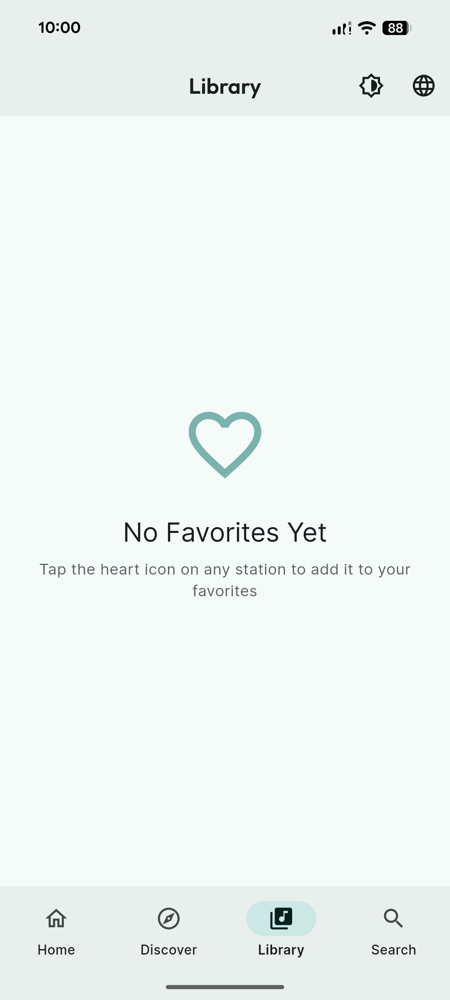
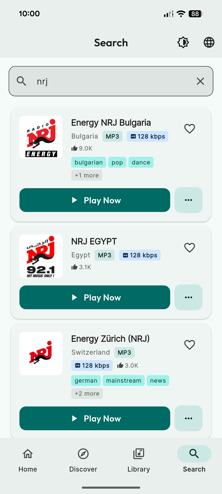
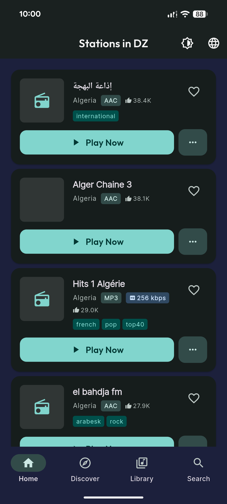
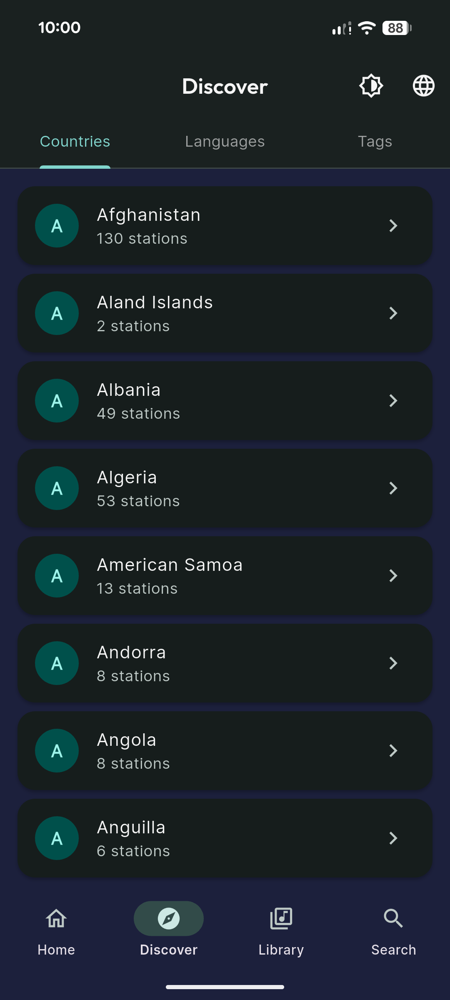
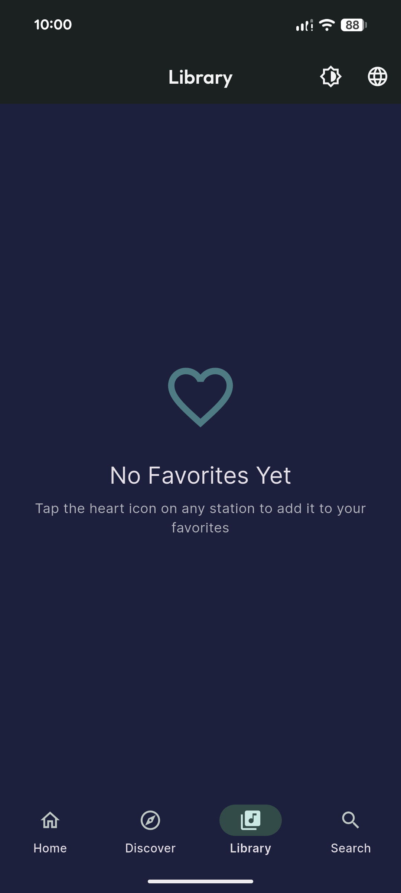
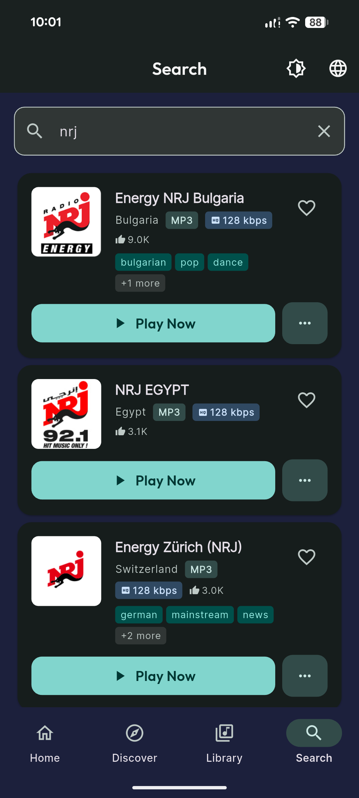

<div align="center">
  
  
  
  
</div>

<div align="center">
  <h1>🎵 TuneAtlas</h1>
  <p><strong>Discover the World's Radio Stations</strong></p>
  <p>A modern, cross-platform radio streaming app built with Flutter, featuring 40,000+ live stations from around the globe.</p>
</div>

<div align="center">
  <a href="#-features">Features</a> •
  <a href="#-screenshots">Screenshots</a> •
  <a href="#-architecture">Architecture</a> •
  <a href="#-getting-started">Getting Started</a> •
  <a href="#-tech-stack">Tech Stack</a> •
  <a href="#-contributing">Contributing</a>
</div>

---

## ✨ Features

### 🌍 Global Radio Discovery
- **40,000+ Stations**: Access radio stations from every corner of the world
- **Smart Search**: Find stations by name, genre, or location with instant results
- **Category Browse**: Explore by country, language, or tag
- **Local Stations**: Automatic detection of stations in your region

### 🎧 Seamless Playback
- **Background Audio**: Listen while using other apps with full media controls
- **System Integration**: Control playback from lock screen, notification panel, and media controls
- **Auto-Reconnect**: Smart network handling resumes playback when connection returns
- **Infinite Buffering**: Reliable streaming that handles varying network conditions

### 📱 Modern User Experience
- **Material 3 Design**: Beautiful, adaptive UI following the latest design guidelines
- **Dark & Light Themes**: Choose your preferred appearance with dynamic color generation
- **Responsive Layout**: Optimized for phones, tablets, and various screen sizes
- **Accessibility**: WCAG AA compliant with proper contrast ratios and semantic labels
- **Smooth Animations**: Delightful micro-interactions with haptic feedback

### ⭐ Personalization
- **Favorites**: Save your preferred stations for quick access
- **Persistent Library**: Your favorites sync across app restarts
- **Recently Played**: Quick access to your listening history
- **Custom Organization**: Manage your collection your way

### 🌐 Internationalization
- **Multi-Language Support**: English and Arabic (RTL) with easy expansion
- **Localized Content**: Station metadata in multiple languages
- **Regional Preferences**: Automatic content adaptation based on location

---

## 📱 Screenshots
### Light
<div align="center">
  
  
  
  
</div>

---
### Dark
<div align="center">
  
  
  
  
</div>

---

## 🏗️ Architecture

TuneAtlas is built with **Clean Architecture** principles and modern Flutter best practices:

### Project Structure
```
lib/
├── main.dart                 # App entry point
└── src/
    ├── core/                 # Shared infrastructure
    │   ├── api/             # HTTP client & Radio Browser API
    │   ├── config/          # Theme, localization, constants
    │   ├── database/        # Local persistence (Sembast)
    │   ├── network/         # Connectivity & reconnection
    │   ├── routing/         # GoRouter configuration
    │   └── utils/           # Helpers & extensions
    └── features/            # Feature modules
        ├── home/            # Local stations discovery
        ├── discover/        # Browse by category
        ├── search/          # Station search
        ├── player/          # Audio playback
        ├── library/         # Favorites management
        └── onboarding/      # First-time user experience
```

### Key Architectural Decisions

#### 🔄 State Management: Riverpod 3.0
- **Code Generation**: Type-safe providers with `@riverpod` annotation
- **Reactive Streams**: Automatic UI updates via `ref.watch()`
- **Dependency Injection**: Single source of truth for all app state
- **Testability**: Easy mocking with provider overrides

#### 🎯 Data Layer
- **Result Pattern**: Type-safe error handling with `Result<T>` wrapper
- **Repository Pattern**: Abstract data sources behind clean interfaces
- **Caching Strategy**: Smart balance between freshness and offline support

#### 🎨 UI Layer
- **Feature-Based**: Vertical slices with `data/` and `presentation/` separation
- **Reusable Widgets**: Shared components in core layer
- **Responsive Design**: Adaptive layouts for all screen sizes

#### 🧪 Code Quality
- **Very Good Analysis**: Industry-standard linting rules
- **Custom Lint**: Riverpod-specific static analysis
- **Code Generation**: Freezed for immutable models, JSON serialization

---

## 🚀 Getting Started

### Prerequisites
- **Flutter SDK**: 3.35.3 or higher
- **Dart SDK**: 3.9.2 or higher
- **IDE**: Android Studio, VS Code, or IntelliJ with Flutter plugin

### Installation

1. **Clone the repository**
   ```bash
   git clone https://github.com/jhonny1994/tuneatlas.git
   cd tuneatlas
   ```

2. **Install dependencies**
   ```bash
   flutter pub get
   ```

3. **Generate code**
   ```bash
   dart run build_runner build --delete-conflicting-outputs
   ```

4. **Run the app**
   ```bash
   # Development mode
   flutter run
   
   # Release mode
   flutter run --release
   ```

### Building for Production

#### Android (APK)
```bash
flutter build apk --release
```

#### Android (App Bundle)
```bash
flutter build appbundle --release
```

#### iOS
```bash
flutter build ios --release
cd ios && pod install
open Runner.xcworkspace
```

---

## 🛠️ Tech Stack

### Core Technologies
| Technology | Purpose | Version |
|------------|---------|---------|
| **Flutter** | Cross-platform UI framework | 3.35+ |
| **Dart** | Programming language | 3.9+ |
| **Material 3** | Design system | Latest |

### State Management & Architecture
| Package | Purpose |
|---------|---------|
| `riverpod` (3.0.0) | State management |
| `riverpod_annotation` | Code generation for providers |
| `freezed` | Immutable models & unions |
| `json_serializable` | JSON serialization |

### Audio & Media
| Package | Purpose |
|---------|---------|
| `just_audio` | Audio streaming |
| `audio_service` | Background playback |
| `audio_session` | Audio focus management |

### Networking & Data
| Package | Purpose |
|---------|---------|
| `dio` | HTTP client |
| `connectivity_plus` | Network status |
| `sembast` | NoSQL local database |
| `shared_preferences` | Key-value storage |
| `cached_network_image` | Image caching |

### UI & UX
| Package | Purpose |
|---------|---------|
| `go_router` | Declarative routing |
| `google_fonts` | Custom typography |
| `shimmer` | Loading placeholders |
| `flutter_localizations` | Internationalization |

### Development Tools
| Tool | Purpose |
|------|---------|
| `build_runner` | Code generation |
| `riverpod_generator` | Provider generation |
| `freezed_annotation` | Model generation |
| `very_good_analysis` | Linting rules |
| `custom_lint` | Custom analyzers |

---

## 📡 Radio Browser API

TuneAtlas uses the [Radio Browser Community API](https://www.radio-browser.info) to provide access to a crowdsourced database of radio stations.

### Features
- 🆓 **Free & Open Source**: No API keys required
- 🌍 **Global Coverage**: 40,000+ stations worldwide
- 🔄 **Real-Time Updates**: Community-maintained metadata
- 🚀 **Server Discovery**: Automatic DNS-based server selection
- ⚡ **High Availability**: Distributed server infrastructure

### API Endpoints Used
- Station search and filtering
- Category browsing (countries, languages, tags)
- Station metadata and favicon URLs
- Click tracking for statistics

---

## 🎨 Design System

### "Marquee" Theme
TuneAtlas features a custom design system built on Material 3:

#### Color Palette
- **T-Sharp** (`#14D8CC`): Vibrant cyan primary color
- **Ink** (`#1C203C`): Deep navy for dark theme backgrounds
- **Gold** (`#FEC25A`): Warm gold accent color
- **Material 3 Generated**: Harmonious color schemes from seed color

#### Typography
- **Primary Font**: Inter (Google Fonts)
- **Display Font**: Outfit (headers and buttons)
- Optimized for readability at all sizes

#### Accessibility
- ✅ **WCAG AA Compliant**: All text meets 4.5:1 contrast minimum
- ✅ **AAA Dark Theme**: 14.48:1 contrast ratio on primary text
- ✅ **Semantic Labels**: Proper screen reader support
- ✅ **Reduced Motion**: Respects user preferences

---

## 🤝 Contributing

We welcome contributions! Here's how you can help:

### Development Process
1. **Fork** the repository
2. **Create** a feature branch (`git checkout -b feature/AmazingFeature`)
3. **Commit** your changes (`git commit -m 'Add some AmazingFeature'`)
4. **Push** to the branch (`git push origin feature/AmazingFeature`)
5. **Open** a Pull Request

### Code Style
- Follow [Effective Dart](https://dart.dev/guides/language/effective-dart) guidelines
- Use `very_good_analysis` linting rules
- Run `dart format .` before committing

---

## 🙏 Acknowledgments

- **Radio Browser Community**: For maintaining the comprehensive radio station database
- **Flutter Team**: For the amazing cross-platform framework
- **Open Source Contributors**: All the package maintainers we depend on

---

## 📧 Contact & Support

- **Issues**: [GitHub Issues](https://github.com/jhonny1994/tuneatlas/issues)
- **Discussions**: [GitHub Discussions](https://github.com/jhonny1994/tuneatlas/discussions)

---

<div align="center">
  <p>Made with ❤️ by <a href="https://github.com/jhonny1994">Jhonny</a></p>
  <p>⭐ Star this repo if you find it useful!</p>
</div>
